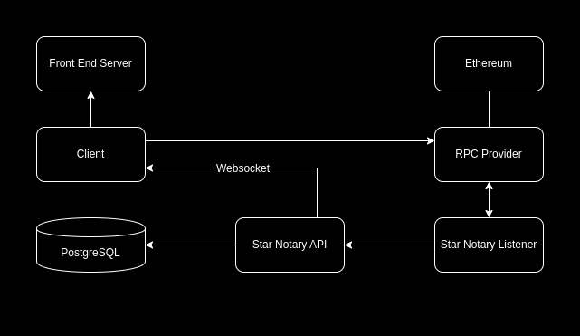

# Star Notary

An NFT Marketplace for registering, naming, and trading Stars!

## Showcase:

## Architecture:

#### Ethereum

Chosen blockchain infrastructure for the Star Notary Smart Contract!

#### RPC Provider

Provides communication to the Blockchain, Infura is a good example

#### Star Notary Listener

Listens for smart contract events, confirms the event using the provided confirmation blocks (default is 12), consumes the Star Notary API after confirmation

#### Star Notary API

Creates, updates, and queries database for star NFTs, publishes all updated stars to the websocket endpoint

#### Client

User facing web-app. Integrates with Metamask, calls contract transactions for changes in star NFT state, calls contract view functions to improve user feedback in between confirmations, queries Star Notary API

